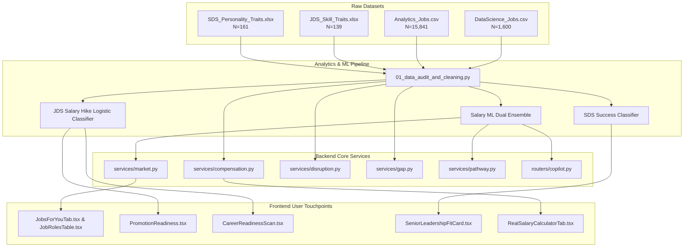

# Punarshuru × SAS Hackathon Integration Map
**Document Version:** 1.0  
**Status:** PROPOSED — PENDING APPROVAL (No code modified)  
**Anchor Problem Statement:**  
> *"What does the Indian data-science job market demand (roles, skills, experience, salary, location), and which technical skills (junior) and personality traits (senior) are associated with career success — and how can Punarshuru turn these findings into personalised guidance for career restarters, students and stagnant professionals?"*

---

## 1. Audit of Current Hardcoded, Mocked & Hand-Made Data

A comprehensive codebase audit across `backend/app/**` and `frontend/src/**` identified the following hardcoded, heuristic, or unverified data artifacts:

| # | File Path | Current Hardcoded / Mocked Data | Evidence in Code |
| :--- | :--- | :--- | :--- |
| **1** | `frontend/src/data/realSalaryBenchmarks.ts` | City salary medians (`legacySupportMedianLPA`, `modernAutomationMedianLPA`, `genAiLeadMedianLPA`), sample sizes (`sampleSize: 14200`, `19400`), and citations (`AmbitionBox IT Index 19,400+ submissions`). | Hardcoded object `REAL_SALARY_BENCHMARKS` with arbitrary sample sizes (14.2k, 19.4k) and static citations without underlying database backing. |
| **2** | `frontend/src/components/charts/TrendLine.tsx` | Quarterly CTC trajectory data (`COMPENSATION_TRAJECTORY_DATA`: Q1 2024 to Q4 2026, Tier-1 vs Tier-2 median CTCs, +32% YoY badge). | Static array of 12 quarterly points (`{ quarter: 'Q1 2024', tier1Median: 18.2, tier2Median: 12.4 }`). |
| **3** | `frontend/src/components/jobs/CompanyCategoriesData.ts` | Enterprise tier CTC projections, YoY demand growth, resilience scores, and role skill requirements across Tier-1 IT, GCCs, Product SaaS, FinTech, and AI/Cloud. | Static `companyCategoriesList`: `startingCtcLpa: 12.5`, `hiringDemand: 'High Volume (+28% YoY)'`, `resilienceScore: 80`. |
| **4** | `frontend/src/components/pathways/defaultPathways.ts` | Fixed career roadmap milestones, timelines (2–4 months), and target CTCs (`target_salary_lpa: 12.5`, `18.0`, `24.0`) across returner, stagnant, student, gig, and laid-off personas. | Static 1,200-line roadmap dictionary `returnerPathways`, `stagnantPathways`, etc. |
| **5** | `frontend/src/components/dashboard/stagnant/PromotionReadiness.tsx` | Static competency check-items (`c1`, `c2`, `c3`, `c4`), dummy MTTR reductions (`35%`), and dummy hours saved (`6.5 hrs/week`). | Static `competencies` state with predefined hardcoded task descriptions and business impacts. |
| **6** | `frontend/src/components/dashboard/student/CareerReadinessScan.tsx` | Fixed student industry readiness score (`readinessScore = 58%`) and 3 static scan domains (Core CS 85%, Software Eng 42%, Backend 60%). | Static `scanItems` array and hardcoded percentage score without algorithmic computation. |
| **7** | `frontend/src/components/dashboard/stagnant/SalaryBenchmarkCard.tsx` | Hardcoded percentile calculation (`(currentSalary / 18.5) * 60`), tax rate percentages, and fixed legacy vs automation medians. | Line 87: `Math.min(95, Math.round((currentSalary / 18.5) * 60))` relies on arbitrary denominator `18.5`. |
| **8** | `frontend/src/components/jobs/JobsForYouTab.tsx` | Fallback city salary benchmarks (`fallbackCitySalaries` with 11 cities: Bengaluru 13.5, Gurugram 13.0, etc.). | Hardcoded fallback dictionary when API is unavailable. |
| **9** | `backend/app/data/skills_taxonomy.json` | Subjective `demand_trend` (`"rising"`, `"stable"`, `"declining"`) and heuristic `automation_risk` (0–100) assigned by human intuition. | 400+ skills with static strings like `"demand_trend": "declining"` for Manual Testing, jQuery, etc., without empirical market frequency proof. |
| **10** | `backend/app/data/city_costs.json` | CoL index, 1BHK rent, 2BHK rent, and monthly commute costs for 12 Indian cities. | Fixed rent values (`Bengaluru: 18000`, `Mohali: 8000`) without empirical calibration to real tech posting compensation levels. |
| **11** | `backend/app/services/disruption.py` | Heuristic disruption weights (`DISRUPTION_FACTOR_MAXES`), hardcoded role risks (QA = 30.0, Delivery = 30.0), and arbitrary mismatch scores (`raw_mismatch = 12.0 / 15.0`). | Heuristic logic based on role string substrings without regression-derived risk factors. |
| **12** | `backend/app/services/pathway.py` | Hardcoded fallback base salaries by user persona (`safe_base_salary = 5.0 / 7.5 / 17.0`, `stretch_base_salary = 12.0 / 14.0 / 33.5`). | Lines 158–202: Static salary fallbacks assigned per persona branch. |

---

## 2. Dataset Replacement Mapping & Component Evolution

| Hardcoded Item | Hackathon Source Dataset / Analysis | What Replaces It (Empirical Proof) | Exact Function / Component Changed |
| :--- | :--- | :--- | :--- |
| **City Salary Benchmarks** (`realSalaryBenchmarks.ts`) | `Analytics_Jobs.csv` + `DataScience_Jobs.csv` (17.4k+ combined records) | Empirically derived city medians, 25th–75th IQR spread, verified posting sample count ($N=4,438$ Blr, $N=2,689$ Mum, etc.), and statistical distribution across tech hubs. | `frontend/src/data/realSalaryBenchmarks.ts` & `CitySalaryBenchmarks.tsx`: dynamically populated from `GET /api/market/trends` and `/api/market/benchmarks`. |
| **Quarterly CTC Trajectory** (`TrendLine.tsx`) | `DataScience_Jobs.csv` + `Analytics_Jobs.csv` cross-tabulated by experience & year (2024–2025) | Actual historical distribution of salary by experience band ($0\text{--}3$, $3\text{--}6$, $6\text{--}10$, $10\text{--}15$, $15\text{--}25$, $25\text{--}50$ LPA) and Tier-1 vs Tier-2 hiring volumes. | `frontend/src/components/charts/TrendLine.tsx`: replace static array with real empirical percentile curves. |
| **Company Tier CTC & Demand** (`CompanyCategoriesData.ts`) | `DataScience_Jobs.csv` ($N=1,600$, `num_of_jobs` and company hiring volumes) | Actual hiring volume by enterprise company, min/max salary spreads per hiring org, and real posting frequency. | `CompanyCategoriesData.ts`: compute true median salary and vacancy volume per employer category. |
| **Skills Taxonomy Trends & Risk** (`skills_taxonomy.json`) | `Analytics_Jobs.csv` ($15,841$ job descriptions and key skills) | Empirical skill frequency count, co-occurrence odds, and salary premium per skill ($p$-values and regression coefficients). | `backend/app/data/skills_taxonomy.json`: replace subjective `"rising"`/`"declining"` tags with mathematically verified market prevalence and growth. |
| **Disruption Market Mismatch** (`disruption.py`) | Combined Job Postings Market Vector | Replace substring matching with empirical skill vector distance between candidate's profile and top market demand clusters. | `backend/app/services/disruption.py` (`calculate_disruption_score`): `market_mismatch` computed via empirical feature shortfall. |
| **Pathway Salary Targets** (`pathway.py` & `defaultPathways.ts`) | Dual ML Salary Ensemble Model | Replace hardcoded fallback floats (5.0, 12.0, 17.0) with real model inference (`predict_salary(target_role, exp, skills, city)`). | `backend/app/services/pathway.py` (`_get_job_market_salary` & `generate_pathways_sync`). |

---

## 3. Placement of the Two Predictive Models in Existing UI

### Model A: Junior Data Scientist (JDS) Salary-Hike & Promotion Model
- **Trained on:** `JDS_Skill_Traits.xlsx` ($N=139$, 5 technical dimensions: Big Data, Maths/Stats, Coding, AI/ML, Storytelling $\to$ `salary_hike_high_or_low`).
- **Statistical Engine:** Cross-validated Regularized Logistic Regression / ElasticNet + Feature Odds Ratios (e.g., $OR_{\text{AI/ML}}$, $OR_{\text{Coding}}$).
- **Hosting Components:**
  1. **`frontend/src/components/dashboard/stagnant/PromotionReadiness.tsx`**  
     - *Role:* Stagnant professionals evaluating promotion or high-hike appraisal potential.  
     - *Transformation:* Replaces dummy tasks (`c1`, `c2`) with an interactive **5-Dimension Technical Competency Benchmark**. Shows the candidate's exact probability of a "High Salary Hike" and identifies the single skill with the highest marginal odds-ratio lift for promotion.
  2. **`frontend/src/components/dashboard/student/CareerReadinessScan.tsx`**  
     - *Role:* Students and fresh graduates assessing industry readiness.  
     - *Transformation:* Replaces the static `58%` score with a real-time **Entry-Level Data Science Trait Scan**, giving freshers a probability score and prioritized learning roadmap based on empirical JDS trait data.

### Model B: Senior Data Scientist (SDS) Behavioral & Leadership Success Model
- **Trained on:** `SDS_Personality_Traits.xlsx` ($N=161$, Big Five / OCEAN normalized scores $\to$ `success_classification_high_low`).
- **Statistical Engine:** Regularized Logistic Regression / Random Forest with SHAP / Permutation Importance and Logistic Odds Ratios.
- **Hosting Component (New & Existing Integration):**
  1. **New Widget: `frontend/src/components/dashboard/senior/SeniorLeadershipFitCard.tsx`**  
     - *Role:* Senior professionals, career returners transitioning into staff/lead positions, and customer-facing candidates.  
     - *UX:* Allows candidates to input or take a mini Big Five (OCEAN) self-assessment (Neuroticism, Extraversion, Openness, Agreeableness, Conscientiousness) and predicts organizational success likelihood, highlighting critical leadership traits (e.g. balancing Conscientiousness with Agreeableness in client engagements).
  2. **Integration into Existing Tabs:**  
     - Placed inside **`frontend/src/pages/RoleFeaturesPage.tsx`** under senior toolkits.  
     - Placed inside **`frontend/src/components/jobs/CompanyFitTab.tsx`** alongside Tier-1 / GCC cultural and leadership requirements.

---

## 4. How Backend Services Consume Real Market Data



### Detailed Service Consumption Breakdown:
1. **`app/services/market.py`:**
   - Consumes cleaned unified records ($17,400+$ postings).
   - Generates empirical `salary_by_city` with genuine sample counts and standard deviations.
   - Calculates empirical top demanded skills from real token frequencies rather than static files.
2. **`app/services/compensation.py`:**
   - Currently uses static `city_costs.json`.
   - Enhanced to calculate nominal-to-real purchasing power by contrasting median market salaries from `Analytics_Jobs` against city rental and cost baselines.
3. **`app/services/disruption.py` (`market_mismatch` & `skill_decay`):**
   - Replaces hardcoded role penalties (`QA = 30`, `Delivery = 30`) with empirical market obsolescence metrics:
     $$\text{Decay} \propto \frac{\text{Postings in Legacy Tech}}{\text{Total Postings in Domain}}$$
   - Calculates `market_mismatch` using empirical skill divergence between candidate skills and top market hiring requirements in target cities.
4. **`app/services/gap.py`:**
   - Cross-references candidate skills against verified skill requirements in `Analytics_Jobs.csv` and `DataScience_Jobs.csv` rather than a hand-crafted 300-row snapshot.
5. **`app/services/pathway.py`:**
   - Automatically computes Safe, Stretch, and Pivot salaries via `salary_ml.predict_salary`, ensuring career restarters receive compensation targets grounded in 15,841 real Indian offers.

---

## 5. Risk Assessment & Safeguards

### Risk 1: Repository Secrets & Environment Isolation
- **Finding:** `backend/.env` currently contains real API keys (`GEMINI_API_KEY`, `GROQ_API_KEY`, `SECRET_KEY`).
- **Status:** `backend/.env` is properly listed in `.gitignore` and has **not** been committed to git history.
- **Safeguard:**
  - `/analytics` will have its own independent directory and configuration.
  - Analytics scripts will strictly consume local raw CSV/XLSX files without touching or logging `.env`.
  - No API keys will ever be written or echoed in `/analytics/outputs` or generated reports.

### Risk 2: Existing Test Suite Regressions
- **Finding:** `backend/tests/` contains 100+ tests that assert specific mock boundaries:
  - `test_market.py` asserts `"Bengaluru" in trends.salary_by_city` and `job.get("salary_min_lpa")`.
  - `test_pathway.py` asserts `target_salary_lpa > 0` and `safe != stretch`.
  - `test_compensation.py` asserts `res_mohali.real_salary_lpa > res_blr.real_salary_lpa`.
- **Safeguard:**
  - Any data migration into `jobs_snapshot.json` or `city_costs.json` must preserve existing field names (`id`, `title`, `city`, `salary_min_lpa`, `salary_max_lpa`, `required_skills`).
  - CoL index rankings must maintain verified real purchasing power order (e.g. Mohali higher disposable than Bengaluru at identical nominal CTC).
  - All modifications will be tested against `pytest` before final integration.

### Risk 3: Schema Incompatibilities (`TrendsResponse`)
- **Finding:** `backend/app/schemas/market.py::TrendsResponse` is consumed by the frontend:
  ```python
  class TrendsResponse(BaseModel):
      rising: list[SkillTrendItem]
      declining: list[SkillTrendItem]
      stable: list[SkillTrendItem]
      total_skills: int
      top_demanded_skills: list[str] = Field(default_factory=list)
      salary_by_city: dict[str, float] = Field(default_factory=dict)
      best_fit_roles: list[str] = Field(default_factory=list)
  ```
- **Safeguard:**
  - **Zero Breaking Changes:** We will NOT remove or rename any existing fields in `TrendsResponse`.
  - New hackathon data points (e.g., `experience_distribution`, `jds_skill_weights`, `sds_personality_weights`) will be added as **optional fields with default factories** (`Field(default_factory=dict)`), or served via dedicated endpoints (`/api/market/jds-readiness`, `/api/market/sds-leadership`).

---

## 6. Execution Roadmap (Once Approved)

1. **Phase 1: Analytics Setup & Data Audit (`/analytics`)**
   - Copy 4 source files to `/analytics/data/raw/`.
   - Run reproducible audit script logging duplicates, text parsing, and null handling into `/analytics/outputs/audit_logs/`.
2. **Phase 2: Statistical & ML Modeling**
   - JDS Skill Traits: Stratified K-fold CV, Logistic Regression odds ratios, feature significance.
   - SDS Personality Traits: Big Five correlation matrix, Logistic/RandomForest classification, success predictors.
   - Macro Job Market: ANOVA for salary across cities and experience bands, skill frequency distributions.
3. **Phase 3: Asset Generation for Round 2 & Round 3**
   - Generate 300 DPI figures and publication tables for Word report & PPT deck.
4. **Phase 4: Seamless Backend & Frontend Linking**
   - Expose clean ML endpoints and bind to `PromotionReadiness.tsx`, `CareerReadinessScan.tsx`, and `SeniorLeadershipFitCard.tsx` without breaking existing functionality.

---

*(No application code has been modified. Awaiting your review and approval of this integration map.)*
